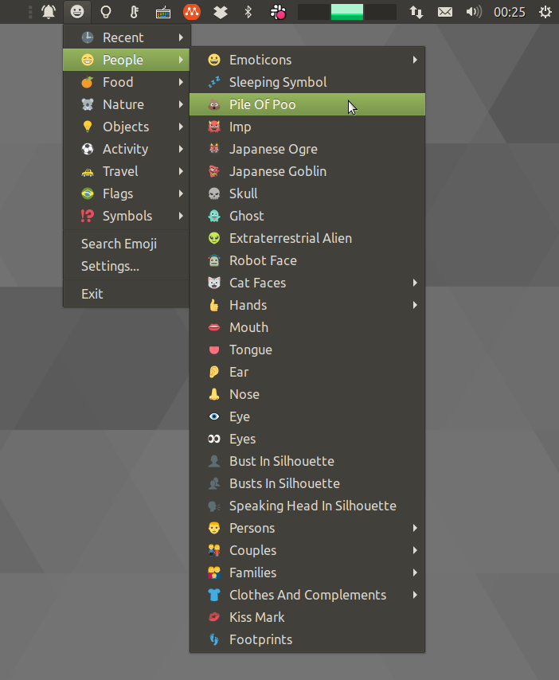

# EmojiTwo Picker

EmojiTwo Indicator is a simple emoji picker for Linux desktop environments such as MATE, Unity, Budgie, and others.



This project is using emoji data from the [EmojiTwo](https://emojitwo.github.io/) project.

## Installation

Installation is optional, but recommended to run the program at session startup easily.

### Method 1: Install Debian Package from PPA

This method requires root access and is only available for Ubuntu 14.04, 15.10 and 16.04 at this moment.

  1. Add [Official PPA](https://launchpad.net/~flexiondotorg/+archive/ubuntu/indicator-emojitwo): `sudo add-apt-repository ppa:flexiondotorg/indicator-emojitwo`
  2. Reload package indexes: `sudo apt-get update`
  3. Install package: `sudo apt install indicator-emojitwo`

### Method 2: Build a Debian Package from source

This method requires root access and was only tested on Ubuntu MATE 19.10 but should work on any Debian/Ubuntu operating system

  1. Install dependencies: `sudo apt-get install python3 gir1.2-notify-0.7 gir1.2-appindicator3-0.1 gir1.2-rsvg-2.0`
  2. Clone the repository and cd into it: `git clone https://github.com/ubuntu-mate/indicator-emojito; cd indicator-emojitwo`
  4. Build the package: `debuild` (*Signing the package might fail at this point, but it's not a big deal*)
  5. Install it! `sudo dpkg -i ../emojione-picker*.deb`

## FAQ

## How to use it

To use the picker:

  1. Choose your emoji from the dropdown menu.
  2. Paste it (usually `Ctrl+V`) wherever you want!

The **emoji search window** let you search emojis writing keywords. You can also assign a global hotkey to the command `emojione-picker` and the search window will open on your current mouse position at any time.


### When I paste all/some icons, they are shown as ugly boxes. I want my money back!

Recent GNU/Linux distributions (including Ubuntu 14.04, 15.10) won't display emojis properly out of the box.

You can get full color emojis working on Firefox with black and white fallback for other applications following these instructions: https://github.com/eosrei/emojione-color-font

### HOw do a make it faster?

The indicator usually takes a few seconds to load, but it can take up to 30 seconds in older computers. In *Settings*, enable the option *Low end computer mode* to reduce the number of menu items (and emojis). That should speed up loading time. Currently, this mode shows about 1000 emojis out of 1800.

### The search dialog is placed under the active window

The **emoji search window** might be incorrectly placed under the current active window due to Unity/Compiz focus stealing prevention feature. This is not intended behaviour. The only known workaround is to disable this feature by running this command:

```
dconf write /org/compiz/profiles/unity/plugins/core/focus-prevention-level 0
```

If you want to enable the focus stealing prevention feature again, just run this command instead:

```
dconf write /org/compiz/profiles/unity/plugins/core/focus-prevention-level 1
```